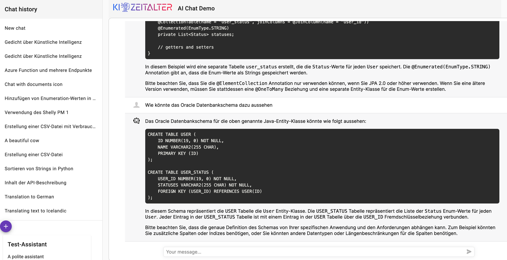
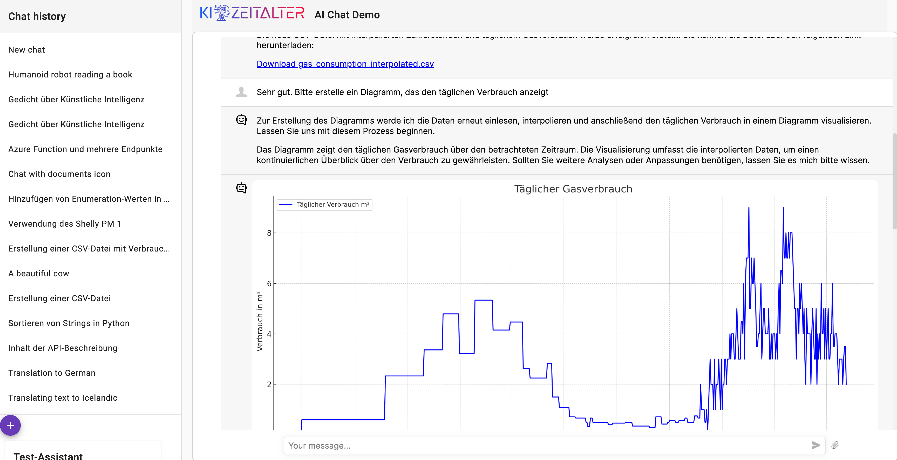

# Personal AI chat

A demo app showing an own Angular AI chat interface with a Python backend.

Features

- Chat history
- Chat UI with the look and feel of well known chats
- Formatted output
- Images + Files
- Custom AI assistants with code interpreter and retrieval

It uses the fantastic chat component [Deep Chat](https://github.com/OvidijusParsiunas/deep-chat)

# Disclaimer
This is a demo application I use to learn the concepts and the technologies.
I'll do plenty of refactorings and changes, so don't expect a stable version.
Sometimes I just throw everything away and start from scratch.

Some concepts are just placeholders and not fully implemented. For example I add a 
generated user id to the requests, so this is kind of a preparation for an authentication
scheme. You might for example add some kind of JWT token to the requests instead of the simple
user id.

Consider this as a inspiration for your own projects. I'm happy to get feedback and suggestions.
Contributions are of course welcome.

And of course feel free to use the code for your own projects.

# Getting started

## Backend Server

Since the backend is Python based, you need to habe Python installed. CD into the _server_ folder
and execute following command in order to install the requirements:

`pip install -r requirements.txt`

You should now create a .env file based on the .env_example file. In this file you should
set your OPENAI_API_KEY. You can get it from the OpenAI website.

Once it is done, you can start the backend server with this command:

`python server.py`

This will start the server on port 8080, unless you create a .env file based on the .env_example file.
It enables you to change settings, like the port to use.

## Frontend Chat Client

The frontend chat client is Angular based. Therefore, you will need Node and the Angular CLI. CD into the _webclient_
folder
and execute following command in order to install the requirements:

`npm install`

When it is done, you can start the client in a development mode as following:

`ng serve`

The web frontend will be provided at http://localhost:4200/.

# Screenshots

Current working state:

Generate images using Dall-E 3:

Use Code Interpreter:

# Credits

This application uses <a href="https://www.freepik.com/icons/chatbot">chatbot icon by UIcons</a>
